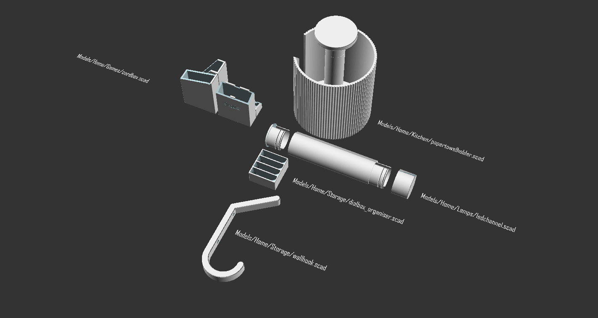
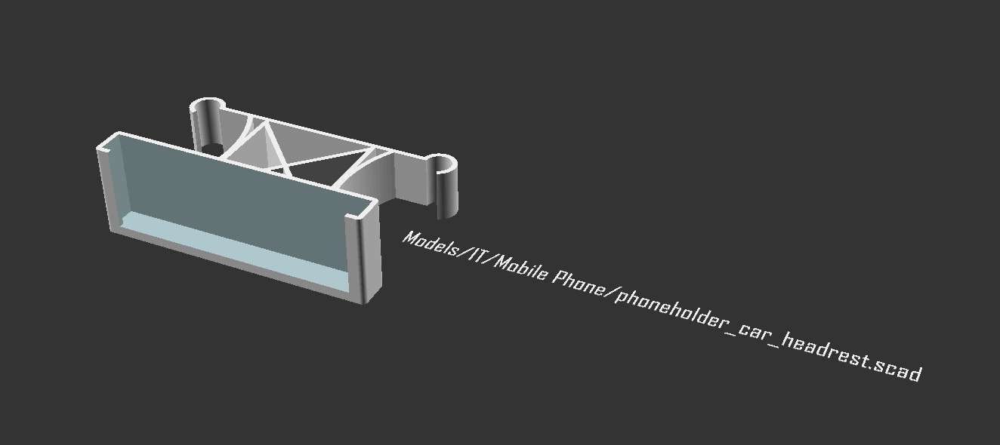
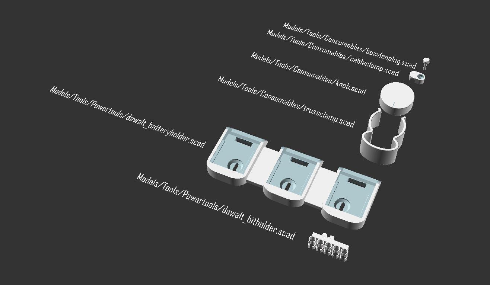

# OpenSCAD script/library/model collection by Richard Bernards
Collection of models, scripts and libraries created to generate 3D-models.

## Structure
The used folder structure is an attempt to quickly locate a specific script by usecase. A list of models with their description is penned down here as well, for people just finding this repository.

Home

### Home/Games
| File | Description |
| --- | --- |
| `cardbox.scad` | Parameterised box to store playing cards. Useful features are multiple designs, configurable sections and ability to add text. |

### Home/Kitchen
| File | Description |
| --- | --- |
| `papertowelholder.scad` | Paper towel holder ready for 3D printing. Uses a springloaded button to be able to secure the roll for easy tear-offs. |

### Home/Lamps
| File | Description |
| --- | --- |
| `ledchannel.scad` | Tubular ledchannel lamp, which features a sectioned design, useful when 3D-printing. |

### Home/Storage
| File | Description |
| --- | --- |
| `dialbox_organiser.scad` | Organiser for watch-dial-boxes commonly used in the watch making industry. |
| `wallhook.scad` | Double wallhook (to hang your coat), dimensions are paraterised. |

IT

### IT/Mobile Phone
| File | Description |
| --- | --- |
| `phoneholder_car_headrest.scad` | Parameterised phoneholder to be attached to the vertical rods of headrests in cars. |

Tools

### Tools/Consumables
| File | Description |
| --- | --- |
| `bowdenplug.scad` | A plug to close off bowden-tube connectors. It also feature a cavity to house a little bit of excess filament. |
| `cableclamp.scad` | A simple cableclamp to be secured using a screw. |
| `knob.scad` | Parameterised knob for potmeters and rotary encoders. Features multiple designs, knurling and indicators. |
| `trussclamp.scad` | A simple parameterised clamp to secure cables to pipes. Mostly used on trusses or other mounting-solutions. |

### Tools/Powertools
| File | Description |
| --- | --- |
| `dewalt_batteryholder.scad` | Parameterised battery holder for DeWalt powertool batteries. Feature several designs and mounting solutions. |
| `dewalt_bitholder.scad` | Bitholder to be attached to DeWalt (impact)drivers and drills. |

