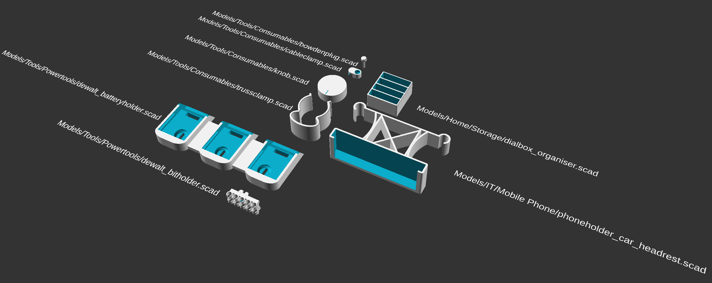

# OpenSCAD script/library/model collection by Richard Bernards
Collection of models, scripts and libraries created to generate 3D-models.

## Structure
The used folder structure is an attempt to quickly locate a specific script by usecase. A list of models with their description is penned down here as well, for people just finding this repository.

Home

### Home/Games
| File | Description |
| --- | --- |
| `cardbox.scad` | Parameterised box to store playing cards. Useful features are multiple designs, configurable sections and ability to add text. |

### Home/Kitchen
| File | Description |
| --- | --- |
| `papertowelholder.scad` | Paper towel holder ready for 3D printing. Uses a springloaded button to be able to secure the roll for easy tear-offs. |

### Home/Storage
| File | Description |
| --- | --- |
| `dialbox_organiser.scad` | Organiser for watch-dial-boxes commonly used in the watch making industry. |

## Render of examples

